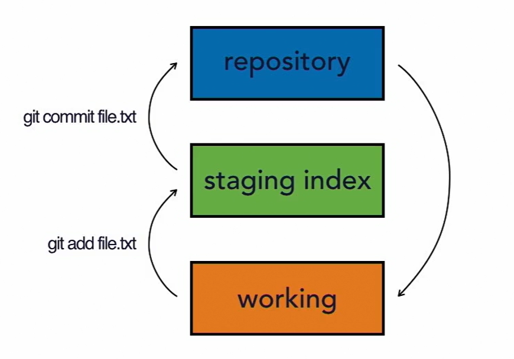

# Git's Three-Tree Architecture

- **Working Directory**: containing changes that may not be tracked by Git
- **Staging Index**: containing changes that are about to be committed into the repository
- **Repository**: being tracked by Git

Git uses a three-tree architecture. 

We first add our files to the staging index (e.g. ```$ git add .```), and then from there we commit to the repository (e.g. ```$ git commit "commit message"```). It was a two-step process. It is also possible to just commit directly to the repository and skip adding them to the staging index. (e.g. ```$ git commit -am "commit message"```)

It's a really nice feature because we can make changes to ten different files in our working copy, and then selectively commit five of the changes as one set. That's why it's called *staging*. We have the chance to add the changes that we want to the *staging*, and then get them ready before we *commit* them. And we can checkout changes from the repository the same way. 

It's also possible to pull them from the repository into the *staging index*, and then from the *staging index* to the *working directory*, but usually that's not what we do. Usually we go ahead and pull them straight from the *repository*, down into the *working directory*. 

There's the *working directory*, which contains changes that may not be tracked by Git yet, there's the *staging index*, which contains changes that we're about to commit into the repository, and then there's the *repository*, and that's what's actually being tracked by Git. The changes that Git has, and that it's going to hold onto and keep track of.


