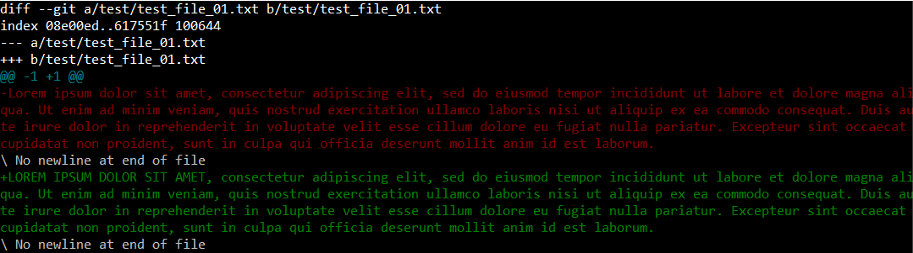
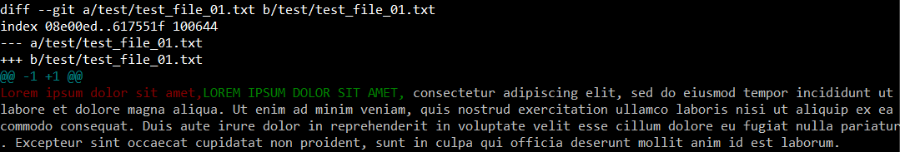

# view the edits

### view changes with ```diff``` (e.g. adding test/test_file_01.txt)

```$ git diff```



```$ git diff --color-words```



### view view only staged changes with ```diff --staged --color-words```

```$ git add .```

```$ git diff --staged```


# compare the commits

```$ git log```

```
commit 71ce59f4358b3bd5899c08476747d213930..
Author: Can Aytoere
Date:   Sun Nov 6 00:10:15 2022 +0100

    delete the text_file

commit 26fdc6803bc48220bb6dff8ab109186b83f..
Author: Can Aytoere
Date:   Sun Nov 6 00:06:03 2022 +0100

    add the text_file
```

```$ git diff 71ce59f..26fdc68 --color-words``` -> to view the comparison between commits

```$ git diff 71ce59f..HEAD --color-words``` -> we may refer to HEAD
